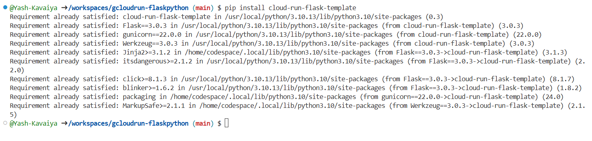
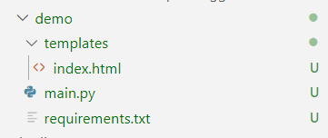
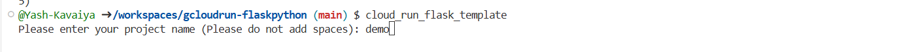

# Cloud Run Flask Template

[](https://badge.fury.io/py/cloud-run-flask-template)

A template for quickly setting up a Flask application for Google Cloud Run deployment.

## Installation

You can install the Cloud Run Flask Template package using pip:

```bash
pip install cloud-run-flask-template
```

## Usage

To create a new Flask project using this template, follow these steps:

1. Run the following command:

```bash
cloud_run_flask_template 
```

2. Navigate to the newly created project directory:

```bash
cd <project_name>
```

3. Start developing your Flask application within this project structure.

## Project Structure

The project structure generated by the Cloud Run Flask Template is as follows:

```
<project_name>/
    ├── main.py
    ├── requirements.txt
    ├── templates/
    │   └── index.html
    └── README.md
```

- `main.py`: Contains the main Flask application code.
- `requirements.txt`: Lists the required Python packages.
- `templates/`: Directory for HTML templates.
- `templates/index.html`: Sample HTML template for the homepage.
- `README.md`: Instructions and information about the project.

## Contributing

Contributions are welcome! Please feel free to open issues or submit pull requests.

## License

This project is licensed under the MIT License - see the [LICENSE](LICENSE) file for details.
```

You can replace `cloud-run-flask-template` with your actual project name in the Usage section, and customize any other placeholders as needed. This README provides clear instructions on how to install and use your package, as well as an overview of the project structure and information on contributing and licensing.